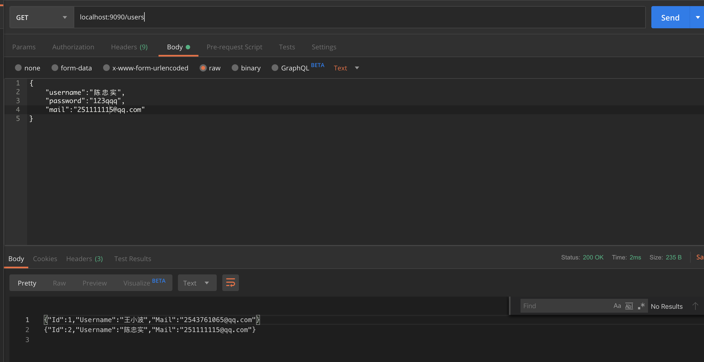
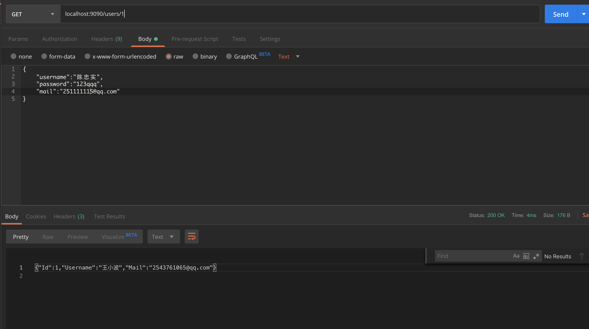
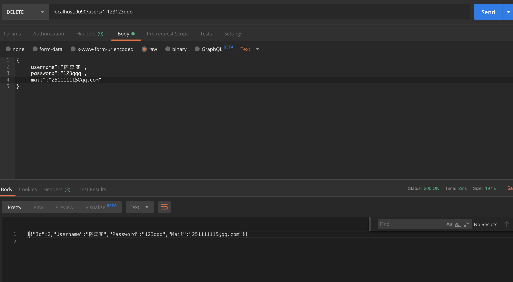
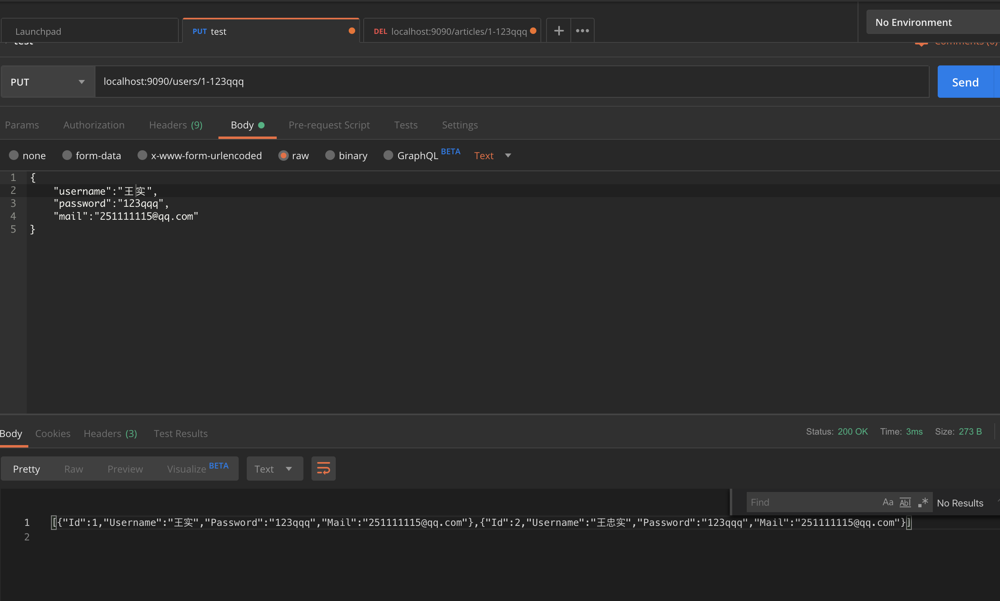
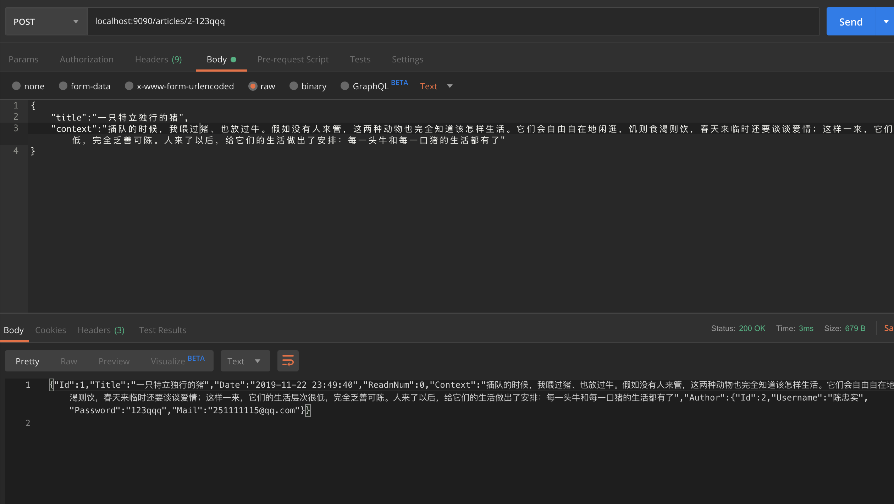
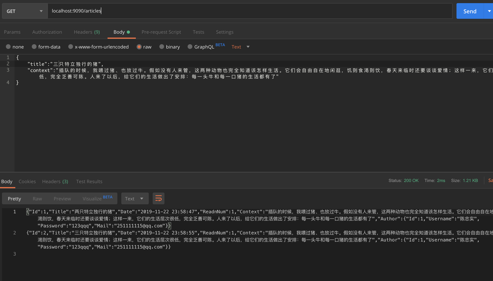
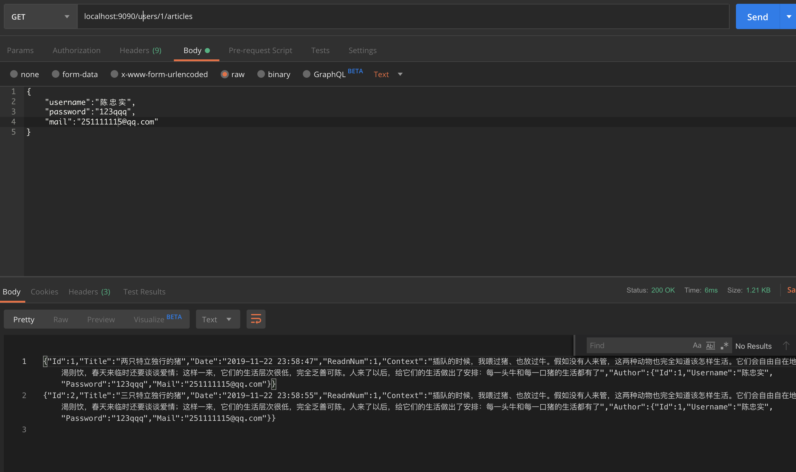
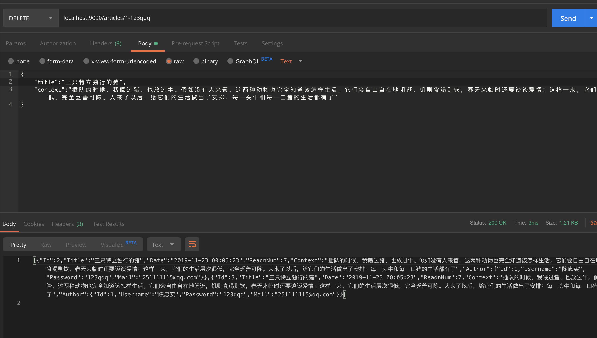
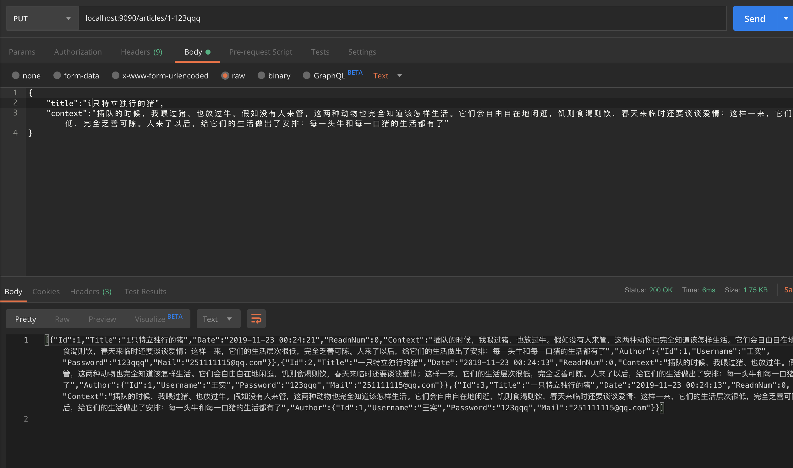

# myapi

## 实验目标

规范：REST API 设计 [Github API v3 overview](https://developer.github.com/v3/) ；[微软](https://docs.microsoft.com/zh-cn/azure/architecture/best-practices/api-design)
作业：模仿 Github，设计一个博客网站的 API

## 实验内容

实现功能有：

1. 实现了用户的创建
2. 实现了用户的查询
3. 实现了单个用户的指定查询
4. 实现了用户的删除
5. 实现了用户的更新
6. 实现了文章的创建
7. 实现了文章阅读量机制
8. 实现了文章的查询
9. 实现了指定作者的文章查询
10. 实现了删除文章功能

### 总体描述

我的程序利用了`gorilla/mux`包，参考了[博客](https://www.cnblogs.com/oxspirt/p/10863154.html)，并且实现了自己的特定类似博客网站的功能（目前只有用户和文章，后续考虑加入评论，为了先交作业。。。），整体设计思路符合无状态这一思路，在服务器只存储数据库信息，不存储状态信息

### 用户的创建

用户在我的程序中使用的结构体如下：

```go
type User struct{
	Id int
	Username string
	Password string
	Mail string
}
```

使用方法是用`POST`访问 `localhost:9090/users`  并提交相应`json`信息


服务端会返回创建用户的信息，每个用户用唯一表示符号Id表示，因此允许重名

```go
func CreateUser(w http.ResponseWriter, r *http.Request) {
	var myuser User
	_ = json.NewDecoder(r.Body).Decode(&myuser)
	if myuser.Username==""||myuser.Password==""||myuser.Mail=="" {
		w.WriteHeader(400)
		fmt.Fprintf(w, "Please Enter username, password and mail")
		return
	}
	myuser.Id=len(users)+1
	users = append(users, myuser)
	json.NewEncoder(w).Encode(myuser)
}
```


### 用户的查询



使用`POST`方法访问`localhost:9090/users`会返回所有用户`json`信息，但没有密码

```go
func QueryUser(w http.ResponseWriter, r *http.Request) {
	for _, user := range users{
		var mypre Presentuser
		mypre.Username=user.Username
		mypre.Mail=user.Mail
		mypre.Id=user.Id
		json.NewEncoder(w).Encode(mypre)
	}
}
```

### 单个用户查询

使用`GET`方法来访问`localhost:9090/user/{id}`，会返回特定用户`json`信息



```go
func QueryAuser(w http.ResponseWriter, r *http.Request){
	inputs := mux.Vars(r)
	fmt.Println(inputs["id"],inputs["xx"])
	for _, user := range users{
		if strconv.Itoa(user.Id)!=inputs["id"] {
			continue
		}
		var mypre Presentuser
		mypre.Username=user.Username
		mypre.Mail=user.Mail
		mypre.Id=user.Id
		json.NewEncoder(w).Encode(mypre)
		break
	}
}
```


### 用户删除

使用`DELETE`方法访问`localhost:9090/users/{id}-{password}`来删除某个用户



会返回删除后的用户组（图中是老版本的，没有做密码隐去处理，新代码已解决）

```go
func DeleteUser(w http.ResponseWriter, r *http.Request) {
	inputs := mux.Vars(r)
	for i, user := range users {
		if strconv.Itoa(user.Id) == inputs["id"] && user.Password==inputs["password"] {
			copy(users[i:], users[i+1:])
			users = users[:len(users)-1]
			break
		}
	}
	for _, user := range users{
		var mypre Presentuser
		mypre.Username=user.Username
		mypre.Mail=user.Mail
		mypre.Id=user.Id
		json.NewEncoder(w).Encode(mypre)
	}
}
```

### 用户的更新

使用`PUT`方法来访问`localhost:9090/users/{id}-{password}`



并提交新的用户信息即可

```go
func UpdateUser(w http.ResponseWriter, r *http.Request) {
	inputs := mux.Vars(r)
	var id int
	id, _ = strconv.Atoi(inputs["id"])
	if users[id-1].Password!=inputs["password"] {
		w.WriteHeader(403)
		fmt.Fprintf(w, "Error Password!")
    return
	}
	var myuser User
	_ = json.NewDecoder(r.Body).Decode(&myuser)
	myuser.Id=id
	users[id-1]=myuser
	json.NewEncoder(w).Encode(users)
}
```

### 文章的创建

文章的结构体为：

```go
type Article struct{
	Id int
	Title string
	Date string
	ReadnNum int
	Context string
	Author User
}
```


使用`POST`方法访问`localhost:9090/articles/{id}-{password}`

必须要使用某个用户才能写文章



会返回某个写成的文章

并且自动生成其写作日期，作者，阅读量

```go
func CreateArticle(w http.ResponseWriter, r *http.Request){
	inputs := mux.Vars(r)
	var nowUser User
	var find bool
	for _,user := range users{
		if strconv.Itoa(user.Id) == inputs["id"] && user.Password== inputs["password"] {
			nowUser=user
			find=true
			break
		}
	}
	if find==false{
		fmt.Fprintf(w, "No such user")
		return
	}
	var myarticle Article
	_ = json.NewDecoder(r.Body).Decode(&myarticle)
	if myarticle.Title=="" {
		w.WriteHeader(400)
		fmt.Fprintf(w, "Please Enter title")
		return
	}
	myarticle.Date=time.Now().Format("2006-01-02 15:04:05")
	myarticle.ReadnNum=0
	myarticle.Author=nowUser
	myarticle.Id=len(articles)+1
	articles = append(articles, myarticle)
	
```

### 文章的查询

利用`GET`方法访问`localhost:9090/articles`



查询会自动增强被阅读到的文章的阅读量

```go
func QueryArticle(w http.ResponseWriter, r *http.Request){
	for i, article := range articles{
		articles[i].ReadnNum=articles[i].ReadnNum+1
		json.NewEncoder(w).Encode(article)
	}
}
```

### 指定作者文章查询

利用`GET`方法访问`localhost:9090/users/{id}/articles`就可以访问特定作者的文章



也会更新访问量

```go
func QueryAuserarticle(w http.ResponseWriter, r *http.Request){
	inputs := mux.Vars(r)
	for _, user := range users{
		if strconv.Itoa(user.Id)!=inputs["id"] {
			continue
		}
		for i, article := range articles{
			if article.Author!=user{
				continue
			}
			articles[i].ReadnNum=articles[i].ReadnNum+1
			json.NewEncoder(w).Encode(article)
		}
		break
	}
}
```

### 删除文章

使用`DELETE`方法来访问`localhost:9090/article/{id}-{password}`

注意这里的id是书本的id，密码是作者的密码



如果密码出错会显示403 forbidden

```go
func DeleteArticle(w http.ResponseWriter, r *http.Request) {
	inputs := mux.Vars(r)
	var myid int
	myid, _ = strconv.Atoi(inputs["id"])
	for i,article := range articles{
		if i == myid - 1{
			if inputs["password"] != article.Author.Password{
				w.WriteHeader(403)
				fmt.Fprintf(w, "Error Password!")
			}
			copy(articles[i:], articles[i+1:])
			articles = articles[:len(articles)-1]
			json.NewEncoder(w).Encode(articles)
			return
		}
	}
}
```

### 文章的更新

使用`PUT`方法访问`localhost:9090/{id}-{passwotd}`即可



```go
func UpdateArticle(w http.ResponseWriter, r *http.Request){
	inputs := mux.Vars(r)
	var id int
	id, _ = strconv.Atoi(inputs["id"])
	if articles[id-1].Author.Password!=inputs["password"] {
		w.WriteHeader(403)
		fmt.Fprintf(w, "Error Password!")
		return
	}
	var myarticle Article
	var tuser User
	_ = json.NewDecoder(r.Body).Decode(&myarticle)
	tuser=articles[id-1].Author
	myarticle.Id=id
	myarticle.Date=time.Now().Format("2006-01-02 15:04:05")
	myarticle.ReadnNum=0
	myarticle.Author=tuser
	articles[id-1]=myarticle
	json.NewEncoder(w).Encode(articles)
}
```

只能更新标题和内容，并且阅读量会归零

## 实验总结

这次作业比较急，有些功能没有经过严谨的测试，可能会出现一些小问题，并且还没有加入评论功能，这些都是可以改进的，这次实验我参考了一些博客，了解到了一些 golang web 编程的技巧，但是我对restful的api还了解不多，这次作业是基于我对restfulapi的理解（无状态，四种基本方法和URI，客户端服务端分离）来做的（也事先调查了相关资料和博客），如果有偏差还望TA谅解。